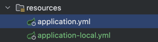

# 떡상🚀🚀(주식 예측 서비스) - 백엔드

<h3><b>📌 프로젝트 시작 배경</b></h3>

요즘 주식에 빠져있는 나
주식 관련해서 뭔가 재미있는 프로젝트를 해보고싶어서 고민하다가 어느정도 생각이 정리되서 진행하게 되었다.
우선은 해당프로젝트를 웹으로 만들어보고 반응이 좋으면 앱으로까지 만들어보려고 한다.

<h3>📌 화면 구성</h3>
- 메인 화면
  - [정중앙] 주식 예측 (떡상? 떡락?)
    - 한국/미국 선택
    - 사용자 입력 창(입력할 때 마다 선택 리스트 나옴)
  - [왼쪽] 주식 물타기 (물타보자)
    - 보유 단가 입력창
    - 보유 수량 입력창
    - 물타기 단가 입력창
    - 물타기 수량 입력창
  - [오른쪽] 가장 많이 예측한 주식 ()
    - 순위 정보(1 ~ 10)

<h3>📌 ETC</h3>
- 폰트
  - [무적해병체](https://www.rokmc.mil.kr:10005/contents/view.do?sMenuKey=304&contentKey=161)

<h3>📌 기능</h3>
- 주식 종목 정보 업데이트
- 각 시장 Top10 순위
- 예측 많이 한 주식 Top10 순위
- 물타기 계산 기능
- 주식 예측

<h3>📝 주식 가격 예측 공식</h3>

주식가격을 예측할때 어떤 공식을 사용할 지 고민해봤다.
요청받은 날짜 기준으로 30거래일의 종가를 이용하려 했는데, 아래 3가지 방법을 찾아내었다.
아래 3가지중 가장 간단한 1번 SMA 방법을 사용하기로 결정했다.

1. 단순 이동평균 (Simple Moving Average, SMA)
   - 최근 30거래일 종가를 모두 더한 뒤 30으로 나누면 평균값(SMA)
   - 만약 SMA가 최근 종가보다 높다면 상승 추세, 낮다면 하락 추세로 해석

2. 지수 이동평균 (Exponential Moving Average, EMA)
   - EMA는 최근 데이터에 더 큰 가중치를 둠
   - 30일 EMA를 계산하려면 처음 SMA를 구한 뒤, 매일 이 공식을 업데이트

3. 간단한 선형 회귀 (Linear Regression)
   - 30일 데이터를 점으로 찍고 직선을 그려서 미래 값(31일째)을 예측, 기울기 b가 양수면 상승, 음수면 하락 추세

<h3>💾 DB 설계 및 구축</h3>
데이터베이스는 MySQL이나 PostgreSQL 중 고민하였으나 아래와 같은 이유로 PostgreSQL을 사용하기로 결정하였다.
- PostgreSQL은 주식 데이터처럼 정확성과 안정성이 중요한 프로젝트에서 더 적합
- JSON, 고급 SQL 기능, 트랜잭션 안정성 등에서 MySQL보다 강점이 많음
- 확장성과 분석 기능이 뛰어나 주식 데이터 저장 및 처리에 최적화

- 유저 정보 테이블(members)
```
# members
```

- 주식 정보 테이블(stocks)

주식 정보 테이블
```
# stock
CREATE TABLE stock (
    stock_id VARCHAR(255) PRIMARY KEY,
    nation_type VARCHAR(255) NOT NULL,
    market VARCHAR(255) NOT NULL,
    stock_name VARCHAR(255) NOT NULL,
    created_at TIMESTAMP NOT NULL,
    updated_at TIMESTAMP NULL
);

-- 인덱스
CREATE INDEX idx_market ON stock(market);
CREATE INDEX idx_stock_name ON stock(stock_name);
```

- 데이터 수집 소요 시간 테이블(data_ingest_duration_log)

데이터가 수집될때 얼마나 걸리는지 확인 하기위한 테이블
```
CREATE TABLE data_ingest_log (
  id INT GENERATED ALWAYS AS IDENTITY PRIMARY KEY,
  run_date DATE NOT NULL,
  script_name VARCHAR(255) NOT NULL,
  start_time TIMESTAMP NOT NULL,
  end_time TIMESTAMP NOT NULL,
  duration FLOAT NOT NULL,
  status VARCHAR(255) NOT NULL
);
```
- 한국투자 Open API 접근 토큰 정보 테이블

한투 API명세서에 아래와 같이 기재되어있다. 토큰과 유효기간을 DB에 저장하여 여러번 API 호출을 막기위한 용도로 사용한다. 
1. 접근토큰(access_token)의 유효기간은 24시간 이며(1일 1회발급 원칙)
   갱신발급주기는 6시간 입니다.(6시간 이내는 기존 발급키로 응답)
2. 접근토큰발급(/oauth2/tokenP) 시 접근토큰값(access_token)과 함께 수신되는
   접근토큰 유효기간(acess_token_token_expired)을 이용해 접근토큰을 관리하실 수 있습니다.
```
CREATE TABLE kis_token (
    id INT PRIMARY KEY,
    access_token text NOT NULL,
    expired_date timestamp NOT NULL,
    created_at timestamp NOT NULL
);
```

<h3>💻 개발</h3>

<h3>📝 국내/해외 주식 전체 정보 수집하기</h3>

한국/미국 주식 전체 정보를 조회하는 방법을 찾아보고 있는데 제공해주는 곳이 국내는 공공데이터포털에서 찾을 수 있었는데 미국주식은 제공해주는곳이 없었다.<br>
프로젝트를 진행하려면 이게 제일 중요한데 어떡하지... 하면서 계속 검색을 해봤는데 파이썬에 FinanceDataReader 이라는 라이브러리가 있었다. <br>
해당 라이브러리를 통해 파이썬으로 데이터를 수집한다.<br>

https://github.com/devrootlee/tteoksang-crawler

<h3>📝 주식 가격 정보 API</h3>

주식 가격 정보를 얻어오기 위해 검색중 한국투자증권이 잘되있는 것 같아서 한국투자증권 Open API를 신청하였다.
- 한국투자증권 Open API 신청
    - [한국투자증권 Open API 홈페이지](https://apiportal.koreainvestment.com/intro)
- 사용할 API
  - [공용]
    - 접근 토큰 발급
      - API: [POST] https://openapi.koreainvestment.com:9443/oauth2/tokenP
  - [한국주식]
    - 주식현재가 일자별
      - API: [GET] https://openapi.koreainvestment.com:9443/uapi/domestic-stock/v1/quotations/inquire-daily-price
  - [미국주식]
    - 해외주식 기간별시세
      - API: [GET] https://openapi.koreainvestment.com:9443/uapi/overseas-price/v1/quotations/dailyprice


<h3>📝 오류 모니터링</h3>
슬랙 웹훅을 사용하여 오류가 발생할 때 슬랙으로 메시지가 가도록 하였다.


<h3>📝 CI/CD</h3>
도커를 이용해 백엔드 이미지, 프론트 이미지를 만들어 배포한다.

<h3>📝 Server</h3>
AWS를 사용하려하였으나 이전 프로젝트에서 free-tier 를 다 사용해서 MS Azure를 사용하기로 하였다.
- Pass 방식
📦 MyResourceGroup
┣ 📂 백엔드 (Spring Boot, Docker) → 가상 머신(ubuntu 24.04)
┣ 📂 프론트엔드 (React, Nginx, Docker) → 가상 머신(ubuntu 24.04)
┗ 📂 데이터베이스 (PostgreSQL) → Azure Database for PostgreSQL 유연한 서버

1. 데이터베이스
- 

2. 백엔드 서버
- property를 개발용과 배포용으로 나누어서 생성
  - 